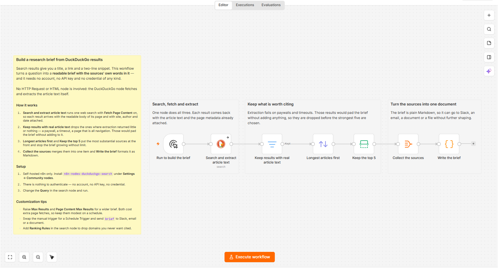
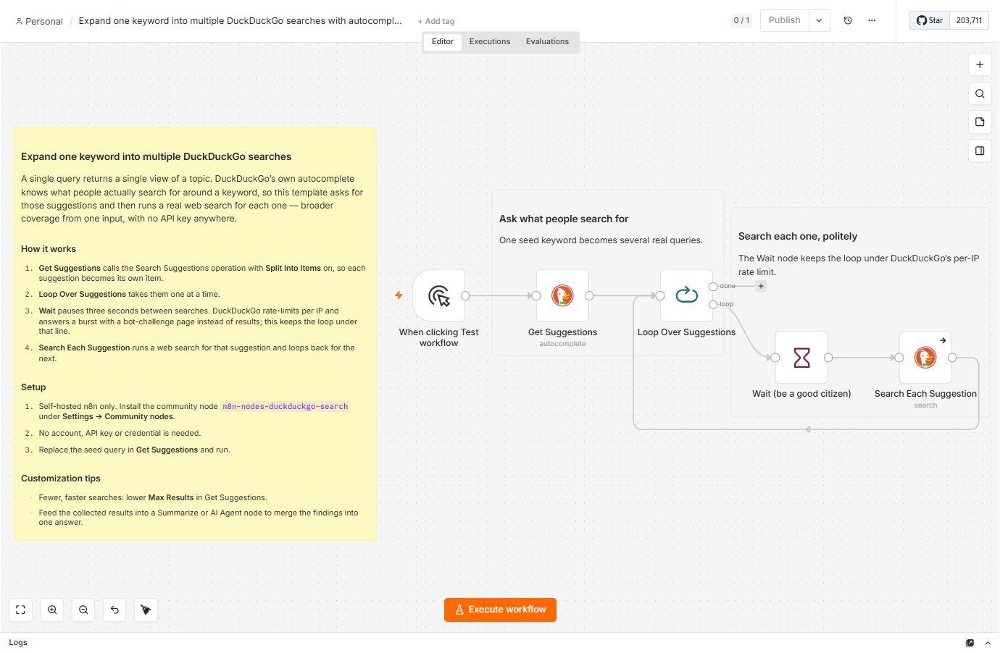
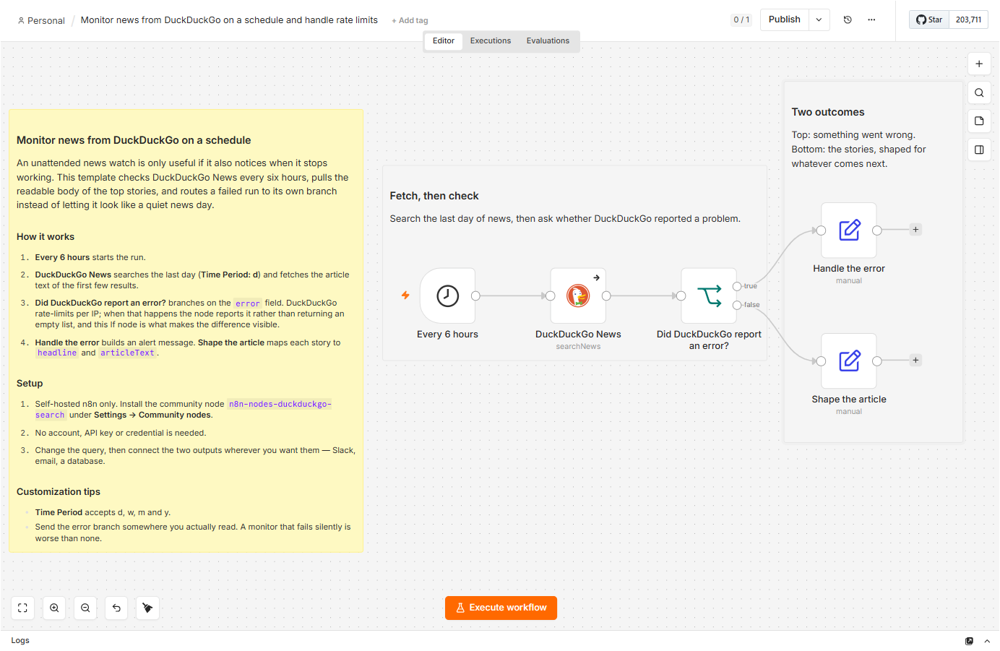
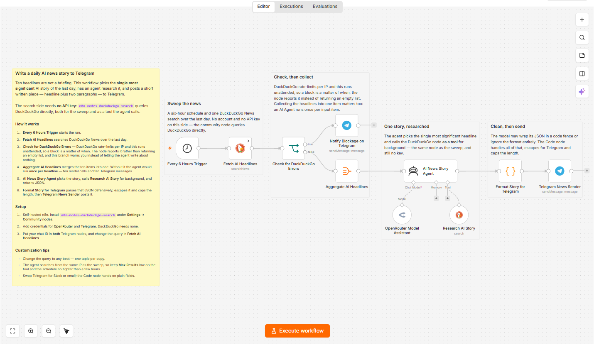

# Submitting these templates to n8n.io/workflows

Notes and ready-to-paste copy for publishing the workflows in this folder on
[n8n.io/workflows](https://n8n.io/workflows/). Rules below were read from the
n8n Creator hub on **2026-09-07**; n8n describe the creator programme as an
ongoing project, so re-check before submitting.

## What n8n requires

From the [Creator hub](https://n8n.notion.site/n8n-Creator-hub-7bd2cbe0fce0449198ecb23ff4a2f76f)
and its [template submission guidelines](https://n8n.notion.site/p/Template-submission-guidelines-9959894476734da3b402c90b124b1f77):

- **A creator account**, registered at <https://creators.n8n.io/register>.
  A new creator may have **one template under review at a time**, and can only
  submit the next after the previous is approved. Three approved templates make
  the account verified, after which templates can be submitted in batches of four.
- **Community-node templates are accepted**, with two additions the guidelines
  call out as a special case:
  - a disclaimer that the template is **self-hosted only**, and
  - a **workflow image at the top of the description**, because the canvas
    preview does not render for community nodes.
- **Sticky notes are mandatory** — per the
  [sticky note guidelines](https://n8n.notion.site/Sticky-note-guidelines-for-templates-2aa5b6e0c94f8058b0aefddd02655887):
  exactly one yellow overview sticky in the top-left corner, 100–300 words,
  containing `### How it works` and `### Setup`; white section stickies (under
  50 words) grouping the nodes of any workflow with four or more of them.
  All four templates in this folder already satisfy this.
- **Title format**: `Action verb` + the thing being manipulated +
  `to/on/in/from where`, sentence-style capitalisation, no emoji, no hype. The
  `name` field of each JSON is already written in that form.
- **Description**: around 200 words, Markdown only (no HTML), with the sections
  *Who's it for*, *How it works*, *How to set up*, *Requirements*,
  *How to customize*.
- No hardcoded credentials, no personal identifiers.

## What the first rejection taught us

Template 1 was submitted on 2026-09-08 and **not published**: *"It is currently
too basic to meet our publishing criteria."* It was two nodes — a trigger and
one DuckDuckGo node — with everything interesting happening inside that node's
options. As a *workflow* that is a configuration sample.

Measured against the live library on 2026-09-11 (`api.n8n.io` template search,
then each workflow's detail): published "research assistant" templates carry
**4–21 real nodes, median about 8**. Two was never going to clear it.

So a template here has to **do a job end to end**, not demonstrate one option.
Both templates below were rebuilt or written to that bar.

Two more things worth knowing, both measured rather than assumed:

- **Requiring credentials is normal.** Published Telegram + AI agent templates
  commonly need 2–5 (`telegramApi` + an LLM, often plus Sheets or Postgres).
  The only credential rule in the guidelines is not to *hardcode* keys.
- **The portal has no image upload field** at any step seen so far, despite the
  guidelines asking for a canvas image. The AI review derives the title from the
  workflow's `name` and pre-fills the description form from the sticky notes.

**Diff the AI's rewritten JSON; do not upload it unread.** It has now been seen
twice. On template 1 it was a regression. On template 4 (2026-09-11) it changed
nothing functional at all — identical parameters, identical wiring, same node
ids — and only renamed the nodes, moved them, and rewrote the stickies. Its
stickies dropped the community-node install step and the self-hosted-only line,
which is exactly what a community-node template must carry. What is in the repo
takes its node names, positions and four-section layout, and keeps our overview
text re-keyed to the new names.

## Before submitting

1. If a description field accepts an image, use the canvas screenshot from
   `images/`. All four are current, taken from a self-hosted n8n with the node
   installed, on the light theme. Retake one whenever a template changes shape —
   a stale canvas is worse than none.
2. Run it once so the description matches what actually happens.
3. Submit through the Creator Dashboard at <https://creators.n8n.io/login>.

Suggested order, given the one-at-a-time limit: **4 → 1 → 3 → 2**. Template 4
goes first because it is the strongest of the set and the only one run end to
end against the real services; the rebuilt template 1 then goes into the
“Implement changes” slot left by the rejection. The news monitor has the
broadest recurring use after that, and query expansion is the most niche.

---

## Template 1 — Build a research brief from DuckDuckGo results with no API key

File: `01-research-assistant.json` — **rebuilt 2026-09-11** after the rejection
above. Seven nodes, and still no credential of any kind.

> 
>
> **Self-hosted n8n only.** This template uses the community node
> `n8n-nodes-duckduckgo-search`, and community nodes cannot be installed on
> n8n Cloud.

### Who's it for

Anyone who needs the *content* of search results rather than a list of links:
research assistants, analysts, anyone assembling a reading pack on a question.

### How it works

A DuckDuckGo web search runs with **Fetch Page Content** enabled, so each result
arrives with the readable body of its page and with site, author and date
attached — no HTTP Request or HTML node involved. Results whose extraction
returned little or nothing are dropped: a paywall or a timeout would pad the
brief without adding to it. The remainder are ordered by how substantial they
are, capped at five, merged into one item and written out as a Markdown brief
with a quote and a link for each source.

### How to set up

1. Install `n8n-nodes-duckduckgo-search` under **Settings → Community nodes**.
2. Nothing to authenticate — no account, no API key, no credential.
3. Change the **Query** in the search node and run.

### Requirements

Self-hosted n8n and the community node. **No credentials at all**, which is
unusual for a research workflow in this library and is the point of this one.

### How to customize

Raise **Max Results** and **Page Content Max Results** for a wider brief; both
cost extra page fetches, so keep them modest on a schedule. Swap the manual
trigger for a Schedule Trigger and send `brief` to Slack, email or a document.
Add **Ranking Rules** in the search node to drop domains you never want cited.

---

## Template 2 — Expand one keyword into multiple DuckDuckGo searches with autocomplete

File: `02-query-expansion.json`

> 
>
> **Self-hosted n8n only.** This template uses the community node
> `n8n-nodes-duckduckgo-search`, and community nodes cannot be installed on
> n8n Cloud.

### Who's it for

SEO and content researchers, keyword analysts, and anyone building a research
agent that should explore a topic rather than answer one narrow question.

### How it works

One seed keyword goes into DuckDuckGo's autocomplete, which returns what people
actually search for around that term. With **Split Into Items** enabled each
suggestion becomes its own item, and a batch loop then runs a real web search
for every one of them. A **Wait** node pauses three seconds between searches:
DuckDuckGo rate-limits per IP and answers a burst with a bot-challenge page
instead of results, and this is what keeps the loop below that line. Each search
is set to continue on error, so one blocked query does not end the run.

### How to set up

1. Install `n8n-nodes-duckduckgo-search` under **Settings → Community nodes**.
2. There is nothing to authenticate — no account, no API key.
3. Replace the seed query in **Get Suggestions** and run.

### Requirements

Self-hosted n8n, and the `n8n-nodes-duckduckgo-search` community node. No
credentials, no paid service.

### How to customize

Lower **Max Results** in Get Suggestions for a shorter, faster run. Raise the
Wait interval if you are running this often from one IP. Feed the collected
results into a Summarize or AI Agent node to merge everything into one answer,
or into a Google Sheet to build a keyword map.

---

## Template 3 — Monitor news from DuckDuckGo on a schedule and handle rate limits

File: `03-news-monitor.json`

> 
>
> **Self-hosted n8n only.** This template uses the community node
> `n8n-nodes-duckduckgo-search`, and community nodes cannot be installed on
> n8n Cloud.

### Who's it for

Anyone running an unattended watch on a topic: competitive intelligence, brand
monitoring, PR, or a daily digest for a team channel.

### How it works

A schedule trigger fires every six hours and searches DuckDuckGo News over the
last day, fetching the readable body of the top stories rather than just their
headlines. The result then passes through an If node that checks for an `error`
field. That branch is the point of the template: DuckDuckGo rate-limits per IP,
and a blocked run should look different from a quiet news day. One output builds
an alert you can send wherever you will see it; the other maps each story to a
`headline` and `articleText` pair, ready for a summariser, a database or a chat
message.

### How to set up

1. Install `n8n-nodes-duckduckgo-search` under **Settings → Community nodes**.
2. There is nothing to authenticate — no account, no API key.
3. Change the query, adjust the schedule, and connect the two outputs to
   wherever you want them.

### Requirements

Self-hosted n8n, and the `n8n-nodes-duckduckgo-search` community node. No
credentials, no paid service.

### How to customize

**Time Period** accepts `d`, `w`, `m` and `y`. Add more queries by duplicating
the news node, or deduplicate against a datastore so a story is only reported
once. Send the error branch somewhere you actually read — a monitor that fails
silently is worse than no monitor.

---

## Template 4 — Write a daily AI news story to Telegram with DuckDuckGo and an AI agent

File: `04-ai-news-writer.json` — ten nodes. The strongest of the set, and the
only one that has been run end to end against the real services.

> 
>
> **Self-hosted n8n only.** This template uses the community node
> `n8n-nodes-duckduckgo-search`, and community nodes cannot be installed on
> n8n Cloud.

### Who's it for

Anyone who wants a written briefing rather than a feed: a team channel that
should get one considered story a day instead of ten headlines nobody opens.

### How it works

A schedule trigger sweeps DuckDuckGo News for the last day. The result passes an
If node that checks for an `error` field first — DuckDuckGo rate-limits per IP
and this runs unattended, so a block is a matter of when; that branch warns you
instead of letting the agent write about nothing. The headlines are then merged
into a single item, which matters: an AI Agent runs **once per input item**, so
without it ten headlines become ten model calls and ten messages.

The agent picks the single most significant story, calls the DuckDuckGo node
**as a tool** for background, and returns JSON. A Code node parses that
defensively — models wrap JSON in code fences, add a preamble, or ignore the
format — escapes it for Telegram and caps the length before it is sent.

### How to set up

1. Install `n8n-nodes-duckduckgo-search` under **Settings → Community nodes**.
2. Add credentials for **OpenRouter** and **Telegram**. DuckDuckGo needs none.
3. Put your chat ID in **both** Telegram nodes and change the query.

### Requirements

Self-hosted n8n, the community node, an OpenRouter account and a Telegram bot.
The search side needs no key.

### How to customize

Change the query to any beat — one topic per copy of the workflow. The agent
searches from the same IP as the sweep, so keep **Max Results** low on the tool
and the schedule no tighter than a few hours. Swap Telegram for Slack or email;
the Code node hands on plain fields.
