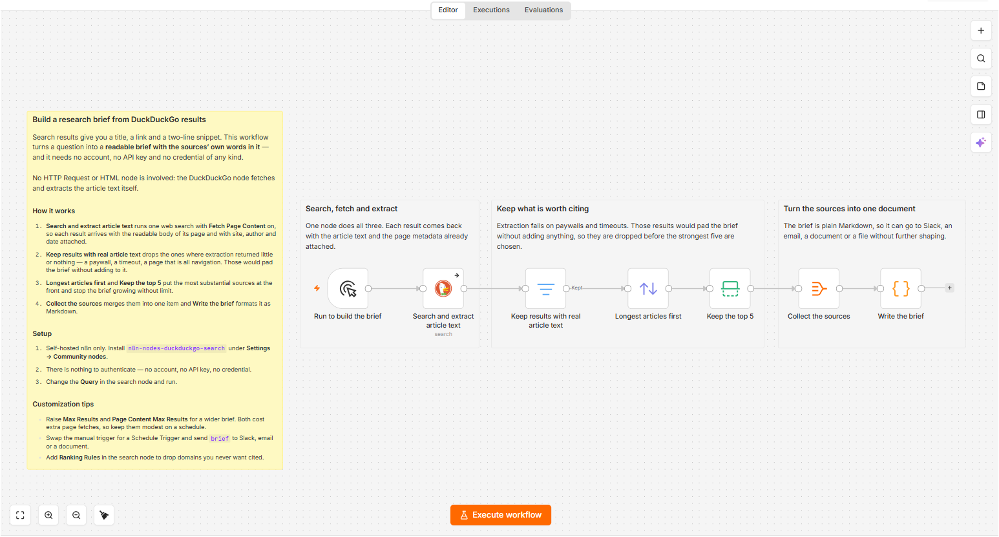
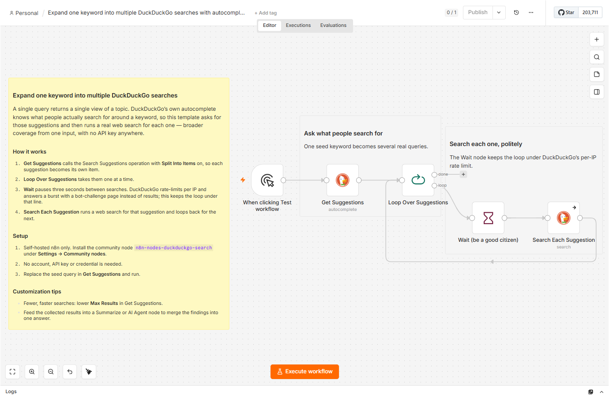
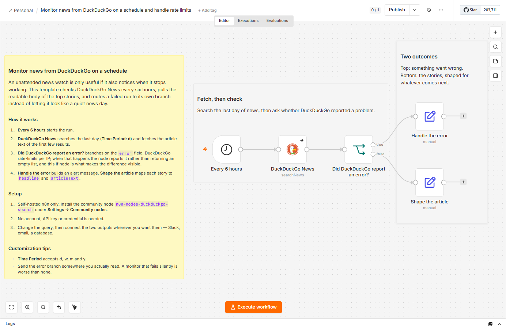
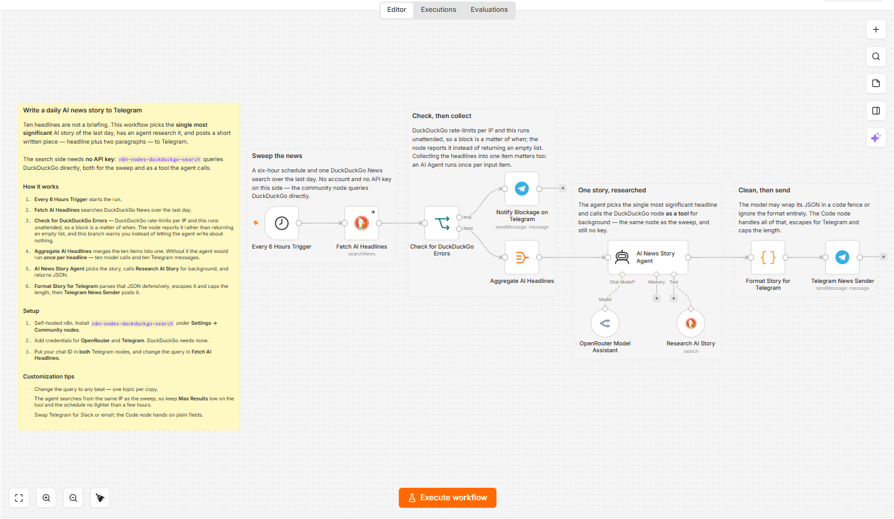
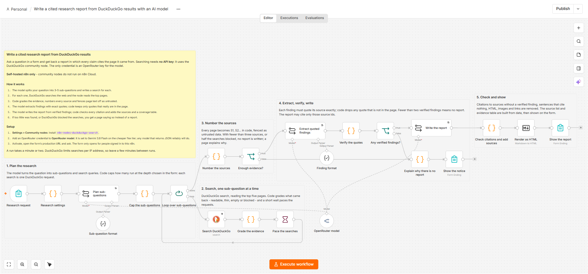
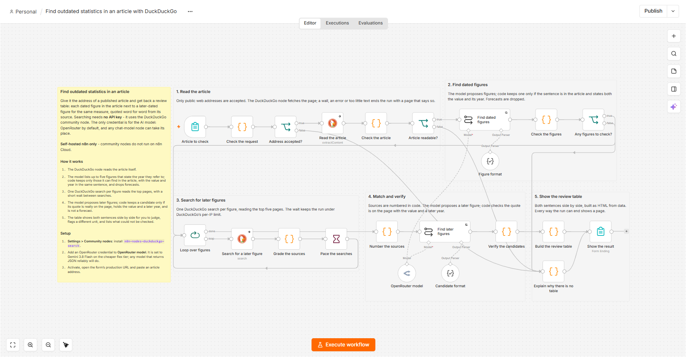

# Submitting these templates to n8n.io/workflows

Notes and ready-to-paste copy for publishing the workflows in this folder on
[n8n.io/workflows](https://n8n.io/workflows/). Rules below were read from the
n8n Creator hub on **2026-09-07**; n8n describe the creator programme as an
ongoing project, so re-check before submitting.

## What n8n requires

From the [Creator hub](https://n8n.notion.site/n8n-Creator-hub-7bd2cbe0fce0449198ecb23ff4a2f76f)
and its [template submission guidelines](https://n8n.notion.site/p/Template-submission-guidelines-9959894476734da3b402c90b124b1f77):

- **A creator account**, registered at <https://creators.n8n.io/register>.
  A new creator may have **one template under review at a time**, and can only
  submit the next after the previous is approved. Three approved templates make
  the account verified, after which templates can be submitted in batches of four.
- **Community-node templates are accepted**, with two additions the guidelines
  call out as a special case:
  - a disclaimer that the template is **self-hosted only**, and
  - a **workflow image at the top of the description**, because the canvas
    preview does not render for community nodes.
- **Sticky notes are mandatory** — per the
  [sticky note guidelines](https://n8n.notion.site/Sticky-note-guidelines-for-templates-2aa5b6e0c94f8058b0aefddd02655887):
  exactly one yellow overview sticky in the top-left corner, 100–300 words,
  containing `### How it works` and `### Setup`; white section stickies (under
  50 words) grouping the nodes of any workflow with four or more of them.
  All six templates in this folder already satisfy this.
- **Title format**: `Action verb` + the thing being manipulated +
  `to/on/in/from where`, sentence-style capitalisation, no emoji, no hype. The
  `name` field of each JSON is already written in that form.
- **Description**: around 200 words, Markdown only (no HTML), with the sections
  *Who's it for*, *How it works*, *How to set up*, *Requirements*,
  *How to customize*.
- No hardcoded credentials, no personal identifiers.

## Status

**Template 5 was approved on 2026-10-05 and is published** as *Write cited research reports from DuckDuckGo search results with OpenRouter*:
<https://n8n.io/workflows/20413-write-cited-research-reports-from-duckduckgo-search-results-with-openrouter/>. It was submitted with the repo JSON unchanged, the screenshot link at the top of the description, and the self-hosted line under Requirements. Templates 1 and 4 were refused as *too basic* (see the next section for why); 2 and 3 were never submitted. Two more approved templates would make the account a verified creator.

**Template 6 was submitted on 2026-10-06 and is under review** (portal id 20511; the portal titled it *Find outdated article statistics with DuckDuckGo and OpenRouter*, and *Additional info* asks for the title without the provider). See its section at the end of this file.

**The upload goes through a firewall that reads the code.** Template 6's first upload failed in the portal with *"Failed to fetch"*: the edge firewall in front of `api.n8n.io` answered 403 with an HTML page and no CORS headers, so the browser saw no response at all. Blanking one node at a time found the trigger - the address check in *Check the request*, written as two regex matches of URL patterns; removing either one let the file through. It is now written with plain string steps. Check a file before submitting it: an unauthenticated `POST` of the JSON to `https://api.n8n.io/api/workflows` that reaches n8n gets a JSON `ForbiddenError`; one the firewall stops gets an HTML page.

## What "too basic" means — n8n's answer (2026-10-04)

**Read this first; it overrides the node-count reasoning further down.** Asked
directly after template 4's third refusal, the creators team (Anshul) answered:
*too basic* is **not** about a minimum number of nodes. They look at whether a
template is **genuinely useful to a broad audience and adds something new to
the library**. Template 4 — a scheduled news search, summarised by AI, sent to
Telegram — is one of the most common patterns they see, with many similar
templates already published, so however well built, it does not add enough.

Template 5's direction — planning sub-questions, checking every quote against
its source, citing each claim — they called "real logic that solves a clear
problem" and "the kind of template we like to see", without promising an
outcome. They repeated: put the canvas screenshot link at the top of the
description.

What follows from it:

- Node counts below explain nothing on their own. The measurements stay as a
  record, but the bar is **novelty and usefulness**, not size.
- Templates 1-4 are all common patterns (a search brief, query expansion, a
  news monitor, an AI news digest). Resubmitting them unchanged is unlikely to
  succeed. Template 5 is the one to submit.
- A future template should start from a problem the library does not already
  solve, not from a feature of the node.

## What the first rejection taught us

Template 1 was submitted on 2026-09-08 and **not published**: *"It is currently
too basic to meet our publishing criteria."* It was two nodes — a trigger and
one DuckDuckGo node — with everything interesting happening inside that node's
options. As a *workflow* that is a configuration sample.

Measured against the live library on 2026-09-11: published "research assistant"
templates carry 4–21 nodes, median about 8. **That number is wrong — see
*The measurement that was wrong* below.** It came from the search API's node
*preview* list, which reports distinct node types rather than node instances. The
real median is **14**. Two nodes was never going to clear it either way.

So a template here has to **do a job end to end**, not demonstrate one option.
Templates 1 and 4 were rebuilt or written to that bar; template 5 was built to it from the start.

Two more things worth knowing, both measured rather than assumed:

- **Requiring credentials is normal.** Published Telegram + AI agent templates
  commonly need 2–5 (`telegramApi` + an LLM, often plus Sheets or Postgres).
  The only credential rule in the guidelines is not to *hardcode* keys.
- **The portal has no image upload field**, and that is by design — see
  *The canvas does not render* below. The AI review writes the title itself -
  starting from the workflow's `name` but free to add to it, and not editable
  afterwards (see Template 6) - and pre-fills the description form from the
  sticky notes.

**Diff the AI's rewritten JSON; do not upload it unread.** It has now been seen
twice. On template 1 it was a regression. On template 4 (2026-09-11) it changed
nothing functional at all — identical parameters, identical wiring, same node
ids — and only renamed the nodes, moved them, and rewrote the stickies. Its
stickies dropped the community-node install step and the self-hosted-only line,
which is exactly what a community-node template must carry. What is in the repo
takes its node names, positions and four-section layout, and keeps our overview
text re-keyed to the new names.

On template 5 (2026-10-05) it was worse. It kept every node and connection, and
renamed the nodes in Title Case, rewriting every `$('…')` reference in the Code
nodes and prompts consistently with the new names. It replaced all six stickies -
the overview and the five sections - with a single sticky that says the workflow
"does not contain any nodes" and tells the reader to add a trigger. Do not upload
it: submit the repo JSON unchanged, with a line in *Additional info* telling the
human reviewer why. Whatever reads the workflow to write those stickies did not
see the nodes, even though the JSON it returned still has all of them.

## The measurement that was wrong

**Read this before trusting any node-count figure elsewhere in this file.**

Two conclusions here were built on `api.n8n.io`'s template **search** response and
its `nodes[]` field. That field is not the workflow's nodes. It is a *preview*
generated from n8n's own registry of known node types, and it has two properties
that broke both measurements:

- it lists **distinct node types**, not node instances, so it undercounts; and
- a node type n8n's registry does not know is **omitted entirely** rather than
  listed without an icon — so **every community node is invisible in it**.

Proved on 2026-09-17 with published template **3231**, *"Search the web with
MCP-based Brave Search Engine on Telegram"*. Its raw workflow JSON
(`api.n8n.io/api/templates/workflows/3231`) contains
`n8n-nodes-mcp.mcpClient` — a community package. The preview field for that same
template does not mention it at all.

**n8n's own search index is blind to them too.** The search endpoint takes a
`nodes=` filter and reports exact population counts for core types —
`n8n-nodes-base.code` → 7,069, `@n8n/n8n-nodes-langchain.agent` → 4,064. Every
community type returns **0**: `n8n-nodes-mcp.mcpClient`,
`@blotato/n8n-nodes-blotato.blotato`, `n8n-nodes-serpapi.serpApi`. Template 3231
uses the first of those and is published. So a published community-node template
is **undiscoverable by node** in n8n's own library, and no filter or aggregation
there can be used to count them.

**Re-measured against raw JSON**, `workflow.nodes[].type` per template, on the
98 templates that parsed out of the first 100 ids returned by the search endpoint:

| | this batch | community-node ones | ours |
|---|---|---|---|
| use a community node | 24 of 98 | — | — |
| real nodes, median | 14 | 17 (n=24) | 10 (t4), 7 (t1) |
| real nodes, 25th percentile | 10 | 13 | — |
| fewer than 10 real nodes | — | 2 of 24 | both of ours |

**Read those as one batch, not as the library.** The 100 ids came from a single
page of the endpoint's default ordering. That ordering is stable across calls but
it is not random and not representative: **0 of the 98 carry the "AI" category,
which tags 69% of the 12,394 published templates.** Two ids are missing — 15694
failed to download, 6281 returns 404, a stale index entry. The community-node
figures additionally rest on 24 cases. A population share would need a sample
stratified on the category proportions the endpoint itself publishes.

There are **12 distinct community packages** in the batch (15 node types —
`n8n-nodes-serpapi.serpApi` and `.serpApiTool` are two types from one package),
including `n8n-nodes-serpapi`, a **search** node and the closest published
comparison to this one.

**The skew argues against us, not for us.** The missing segment is AI-tagged
workflows, and AI-agent templates tend to carry *more* nodes, not fewer — model,
memory and tool sub-nodes each count. A sample with none of them most likely
**understates** the real median. So "ours is small relative to what gets
published" survives the sampling problem even though the number 14 does not.

**What this overturns:**

- *"No published template uses a community node"* — **false**. About a quarter do.
- *"Published templates run 4–21 nodes, median about 8"* — **false**, and it was
  measured with the same broken field. The batch above puts the median at 14,
  with the caveats above.
- *"The identical rejection sentence cannot be about the workflow"* — **retracted**.
  Templates 1 and 4 sit at or below the 25th percentile of everything published,
  and below the 25th percentile of community-node templates specifically. "Too
  basic" is consistent with what the library actually contains.

The rendering limitation is still real and n8n confirmed it. It is just not
evidence that our submissions failed for that reason, since a quarter of the
library has the same limitation and is published.

## The canvas does not render — link the screenshot yourself

Templates 1 and 4 were both refused with the same sentence, word for word:
*"It is currently too basic to meet our publishing criteria."* Template 4 was
refused a third time on 2026-09-17, after a resubmission carrying the screenshot
link.

A scan on 2026-09-14 appeared to show that **no** published template used a
community node. **That was wrong** — see *The measurement that was wrong* below.
Roughly a quarter of published templates use one.

n8n's creator team, asked directly on 2026-09-14, confirmed the **rendering
limitation and the fix**:

> Templates using community nodes can be published in the library. However,
> you're correct that the canvas preview may not render properly when a workflow
> contains a community node. The reviewer still receives the submitted JSON, but
> the missing visual preview can make the workflow harder to assess.
>
> The workflow image mentioned in the guidelines should be added **at the top of
> the template description** rather than through a separate upload field. Since
> the current submission flow doesn't make that clear, please include a
> **publicly accessible link** to a screenshot of the complete canvas when you
> resubmit. A GitHub-hosted image is fine.

**Read that carefully, and keep the two apart.** What is *confirmed* is that the
preview may not render, that this can make a workflow harder to assess, and that
the image belongs in the description as a link. What is *ours* was the conclusion
that this is why both templates came back — and **that inference is now retracted**.
It rested on a measurement that turned out to be measuring nothing, and about a
quarter of published templates carry a community node and the same rendering
problem while being published anyway. n8n never said the preview caused either
rejection, and they pointed out the reviewer does still receive the JSON.

So do not treat the screenshot as a fix that makes an unchanged resubmission
succeed. It removes a known obstacle; if a template comes back a third time with
the same sentence, the cause is something else and the next step is to ask what,
not to guess again.

**What to do:** put the screenshot at the very top of the description as a
Markdown image, not as a bare URL — the description is Markdown-only, so a bare
URL renders as a link and the reviewer still has no canvas to look at. The images
in `images/` are committed, so each has a stable public URL. Paste one of these
verbatim:

```markdown











```

If a field strips Markdown or the word counter fights it, fall back to the bare
URL on its own line — that still satisfies what was literally asked for — but try
the image form first.

### On a revision there is no field for it — send it by email

**The "Implement changes" dialog has no description fields at all** (seen
2026-09-15): the workflow JSON, a *Submit for human review* button, and nothing
else. The description written at first submission is not editable there.

So on a revision: **upload the JSON, submit, and reply to the reviewer's email
with the Markdown image line above.** The reviewer asked for the link herself and
is already on that thread, so it reaches a person either way.

**Do not embed the screenshot inside the overview sticky.** It was tried on
2026-09-15 and reverted, for three reasons, the first of which is fatal:

1. **It is self-referential.** The screenshot is a picture of the canvas; putting
   it inside a sticky on that canvas means the next screenshot shows a sticky
   containing the previous screenshot, and every layout edit invalidates the
   image that lives inside the layout.
2. **It only helps in a scenario we cannot verify.** The description was
   pre-filled from the stickies at *first* submission; nothing shows a revision
   re-derives it. And if the canvas does not render for the reviewer, the
   rendered sticky does not reach them either.
3. **It costs real content.** Template 4's overview was at 298 of the 300
   permitted words, so making room meant cutting text that was doing a job.

All six URLs were checked as publicly reachable (1-5 on 2026-09-30, 6 on 2026-10-06): HTTP 200, `image/png`, and the
bytes match the committed file. Retake and re-commit whenever a template changes shape —
the URL stays the same, so a stale screenshot would silently mislead a reviewer.

## Before submitting

1. **Put the screenshot at the top of the description, as a Markdown image** —
   see the section above for the exact line. Without it the reviewer has no
   canvas to look at. All six images are current, taken from a self-hosted n8n
   with the node installed, on the light theme.
2. Run it once so the description matches what actually happens.
3. Submit through the Creator Dashboard at <https://creators.n8n.io/login>.

Suggested order, given the one-at-a-time limit: **4 → 1 → 3 → 2**. Template 4
goes first because it is the strongest of templates 1-4 and the only one of
them run end to end against the real services; the rebuilt template 1 then goes into the
“Implement changes” slot left by the rejection. The news monitor has the
broadest recurring use after that, and query expansion is the most niche.

**Template 5 (added 2026-09-30) replaces that order.** Against n8n's answer at
the top of this file, it is the strongest candidate of templates 1-5: templates 1-4
are common patterns, and the creators team described template 5's direction as
the kind they like to see - without promising an outcome. That it adds
something the library lacks is our judgement, not theirs. It went first and is
published (see *Status*). Template 6 followed and is under review; leave templates
1-4 as they are unless one is reworked into something new.

---

## Template 1 — Build a research brief from DuckDuckGo results with no API key

File: `01-research-assistant.json` — **rebuilt 2026-09-11** after the rejection
above. Seven nodes, and still no credential of any kind.

> 
>
> **Self-hosted n8n only.** This template uses the community node
> `n8n-nodes-duckduckgo-search`, and community nodes cannot be installed on
> n8n Cloud.

### Who's it for

Anyone who needs the *content* of search results rather than a list of links:
research assistants, analysts, anyone assembling a reading pack on a question.

### How it works

A DuckDuckGo web search runs with **Fetch Page Content** enabled, so each result
arrives with the readable body of its page and with site, author and date
attached — no HTTP Request or HTML node involved. Results whose extraction
returned little or nothing are dropped: a paywall or a timeout would pad the
brief without adding to it. The remainder are ordered by how substantial they
are, capped at five, merged into one item and written out as a Markdown brief
with a quote and a link for each source.

### How to set up

1. Install `n8n-nodes-duckduckgo-search` under **Settings → Community nodes**.
2. Nothing to authenticate — no account, no API key, no credential.
3. Change the **Query** in the search node and run.

### Requirements

Self-hosted n8n and the community node. **No credentials at all**, which is
unusual for a research workflow in this library and is the point of this one.

### How to customize

Raise **Max Results** and **Page Content Max Results** for a wider brief; both
cost extra page fetches, so keep them modest on a schedule. Swap the manual
trigger for a Schedule Trigger and send `brief` to Slack, email or a document.
Add **Ranking Rules** in the search node to drop domains you never want cited.

---

## Template 2 — Expand one keyword into multiple DuckDuckGo searches with autocomplete

File: `02-query-expansion.json`

> 
>
> **Self-hosted n8n only.** This template uses the community node
> `n8n-nodes-duckduckgo-search`, and community nodes cannot be installed on
> n8n Cloud.

### Who's it for

SEO and content researchers, keyword analysts, and anyone building a research
agent that should explore a topic rather than answer one narrow question.

### How it works

One seed keyword goes into DuckDuckGo's autocomplete, which returns what people
actually search for around that term. With **Split Into Items** enabled each
suggestion becomes its own item, and a batch loop then runs a real web search
for every one of them. A **Wait** node pauses three seconds between searches:
DuckDuckGo rate-limits per IP and answers a burst with a bot-challenge page
instead of results, and this is what keeps the loop below that line. Each search
is set to continue on error, so one blocked query does not end the run.

### How to set up

1. Install `n8n-nodes-duckduckgo-search` under **Settings → Community nodes**.
2. There is nothing to authenticate — no account, no API key.
3. Replace the seed query in **Get Suggestions** and run.

### Requirements

Self-hosted n8n, and the `n8n-nodes-duckduckgo-search` community node. No
credentials, no paid service.

### How to customize

Lower **Max Results** in Get Suggestions for a shorter, faster run. Raise the
Wait interval if you are running this often from one IP. Feed the collected
results into a Summarize or AI Agent node to merge everything into one answer,
or into a Google Sheet to build a keyword map.

---

## Template 3 — Monitor news from DuckDuckGo on a schedule and handle rate limits

File: `03-news-monitor.json`

> 
>
> **Self-hosted n8n only.** This template uses the community node
> `n8n-nodes-duckduckgo-search`, and community nodes cannot be installed on
> n8n Cloud.

### Who's it for

Anyone running an unattended watch on a topic: competitive intelligence, brand
monitoring, PR, or a daily digest for a team channel.

### How it works

A schedule trigger fires every six hours and searches DuckDuckGo News over the
last day, fetching the readable body of the top stories rather than just their
headlines. The result then passes through an If node that checks for an `error`
field. That branch is the point of the template: DuckDuckGo rate-limits per IP,
and a blocked run should look different from a quiet news day. One output builds
an alert you can send wherever you will see it; the other maps each story to a
`headline` and `articleText` pair, ready for a summariser, a database or a chat
message.

### How to set up

1. Install `n8n-nodes-duckduckgo-search` under **Settings → Community nodes**.
2. There is nothing to authenticate — no account, no API key.
3. Change the query, adjust the schedule, and connect the two outputs to
   wherever you want them.

### Requirements

Self-hosted n8n, and the `n8n-nodes-duckduckgo-search` community node. No
credentials, no paid service.

### How to customize

**Time Period** accepts `d`, `w`, `m` and `y`. Add more queries by duplicating
the news node, or deduplicate against a datastore so a story is only reported
once. Send the error branch somewhere you actually read — a monitor that fails
silently is worse than no monitor.

---

## Template 4 — Write a daily AI news story to Telegram with DuckDuckGo and an AI agent

File: `04-ai-news-writer.json` — ten nodes. The strongest of templates 1-4, and
the only one of them that has been run end to end against the real services.

> 
>
> **Self-hosted n8n only.** This template uses the community node
> `n8n-nodes-duckduckgo-search`, and community nodes cannot be installed on
> n8n Cloud.

### Who's it for

Anyone who wants a written briefing rather than a feed: a team channel that
should get one considered story a day instead of ten headlines nobody opens.

### How it works

A schedule trigger sweeps DuckDuckGo News for the last day. The result passes an
If node that checks for an `error` field first — DuckDuckGo rate-limits per IP
and this runs unattended, so a block is a matter of when; that branch warns you
instead of letting the agent write about nothing. The headlines are then merged
into a single item, which matters: an AI Agent runs **once per input item**, so
without it ten headlines become ten model calls and ten messages.

The agent picks the single most significant story, calls the DuckDuckGo node
**as a tool** for background, and returns JSON. A Code node parses that
defensively — models wrap JSON in code fences, add a preamble, or ignore the
format — escapes it for Telegram and caps the length before it is sent.

### How to set up

1. Install `n8n-nodes-duckduckgo-search` under **Settings → Community nodes**.
2. Add credentials for **OpenRouter** and **Telegram**. DuckDuckGo needs none.
3. Put your chat ID in **both** Telegram nodes and change the query.

### Requirements

Self-hosted n8n, the community node, an OpenRouter account and a Telegram bot.
The search side needs no key.

### How to customize

Change the query to any beat — one topic per copy of the workflow. The agent
searches from the same IP as the sweep, so keep **Max Results** low on the tool
and the schedule no tighter than a few hours. Swap Telegram for Slack or email;
the Code node hands on plain fields.

---

## Template 5 — Write a cited research report from DuckDuckGo results with an AI model

File: `05-cited-research-report.json` — 22 real nodes (three of them model and
output-parser sub-nodes) and six stickies. Needs a credential for the AI model
(OpenRouter by default); the search side needs none.

> 
>
> **Self-hosted n8n only.** This template uses the community node
> `n8n-nodes-duckduckgo-search`, and community nodes cannot be installed on
> n8n Cloud.

### Who's it for

Anyone who needs an answer they can check - analysts, students, writers - and
would rather be told "not enough was found" than get a confident report written
from a model's memory.

### How it works

A form takes a question and a depth. The model splits it into three to five
sub-questions with a search query each; code caps how many run, since each
search is one DuckDuckGo request. A loop searches for each one, reads the top
five pages and waits between searches.

Code numbers every source and fences its text off as untrusted. The model
extracts findings with quotes, and code keeps only the quotes that really are in
the page. The model writes the report from those findings; code then drops
citations to unverified sources and sentences that cite nothing, strips HTML and
links, and adds the source list and a coverage table. With too little evidence,
or the searches blocked, the form explains why instead of showing a report.

### How to set up

1. Install `n8n-nodes-duckduckgo-search` under **Settings → Community nodes**.
2. Add an OpenRouter credential to **OpenRouter model** (Gemini 3.8 Flash by
   default; any model that returns JSON reliably will do).
3. Activate the workflow and open the form's production URL.

### Requirements

Self-hosted n8n, the community node and an OpenRouter account.

### How to customize

Change the depth options or the number of pages read per search. Keep the wait
between searches: DuckDuckGo limits requests per IP address. Swap the form
ending for email or Slack.

### What the live runs showed (2026-09-29)

Three runs on the author's instance, Gemini 3.8 Flash through OpenRouter, one
run per question - examples, not rates. Time is from the start of the execution
to its last node; nobody waiting on the form is included.

| Question | Depth | DuckDuckGo searches | Time | Result |
|---|---|---|---|---|
| Heat pumps in cold climates (first version) | Standard | 4 | 63 s | Report; 12 of 12 quotes found in their sources; 2 of 4 sub-questions with at least one |
| Intermittent fasting (before the gate fix below) | Quick | 3 | 36 s | No report |
| Intermittent fasting (after it) | Quick | 3 | 48 s | Report; 10 of 10 quotes found in their sources; 3 of 3 sub-questions with at least one |

A verified quote is one whose text really is in the source it names. That says
the report is tied to what was read; it does not say the source is right.

- **Unanswered sub-questions in the first run were a matter of evidence.** One
  sub-question's results were off-topic (UK price calculators for a question
  about backup heating); another's were search snippets that named field studies
  without giving their results. The same evidence - with this model, and page
  text cut at about 3,000 characters - was run through three extraction designs,
  three times each, and none found anything for those two sub-questions. The
  report says so in *Gaps and limits*.
- **Research publishers refuse page fetches.** On the medical question, 6 and 7
  of 18 results answered HTTP 403 in the two runs (the same question, so partly
  the same URLs): BMJ, MDPI, ScienceDirect and ResearchGate both times, Wiley
  and PubMed Central in the first, the journal NMCD in the second. The first
  version refused to write a report because too few *pages* were readable,
  although the search snippets carried the facts.
  The gate now only stops with fewer than three sources or half the searches
  blocked; whether there is enough to report is decided by the verified quotes,
  and a report needs at least two.

---

## Template 6 — Find outdated statistics in an article with DuckDuckGo

File: `06-outdated-statistics.json` — 22 real nodes (three of them model and
output-parser sub-nodes) and six stickies. Needs a credential for the AI model
(OpenRouter by default); the search side needs none. The workflow name names
DuckDuckGo and not the model provider, because the provider is a swappable part.

**Submitted 2026-10-06 and under review** (portal id 20511). What went in: the
current `06-outdated-statistics.json`, uploaded over the pre-rename JSON the draft
was created from, and the description fields below in place of the AI's
pre-filled ones, which named OpenRouter. The AI's rewritten JSON was not used.

**The portal's title is not editable** (seen on the *Finalize your submission*
page): its AI writes the title and shows it as plain text. It titled this template
"Find outdated article statistics with DuckDuckGo and OpenRouter", and it added
"with OpenRouter" to template 5 although that workflow's name did not contain it -
so re-uploading a renamed JSON is not expected to change it. The title without the
provider is asked for in *Additional info* instead; whether it changes is the
reviewer's call.

While a template sits unfinished and two others wait in *Implement changes*,
*Share new template* is disabled behind a "Submission limit reached" dialog
(seen on the draft; it was still disabled after submission).

Chosen on 2026-10-05 against n8n's bar (*useful to a
broad audience and new to the library*): a keyword search of the library found
nothing that checks an article's old figures against newer sources.

> 

The portal now asks for the description in fields, with word counters: Quick
overview 10-50 words, How it works and Setup 50+ each. Requirements and
Customization are lists; Enter adds the next row. Paste these:

**Quick overview**

```text


Paste an article's address; this workflow lists its dated figures and, for each, a later-dated figure from the web, quoted word for word from its source, side by side for you to review. Self-hosted n8n only.
```

**How it works**

1. A form takes the article's address and, optionally, a region.
2. The DuckDuckGo node reads the article.
3. The model lists up to five figures that state the year they refer to; code keeps only those whose sentence is really in the article with the value and the year, and drops forecasts.
4. One DuckDuckGo search per figure reads the top five pages, with a short wait between searches.
5. The model proposes later figures; code keeps a candidate only if its quote is on the source page, holds the value and a later year close together, and is not a forecast. A different unit is flagged.
6. The form shows a review table: the article's sentence next to the later one, with its source. Every way the run can end shows a page.

**Setup**

1. Self-hosted n8n: install `n8n-nodes-duckduckgo-search` under Settings → Community nodes. Searching and reading pages need no API key or account.
2. Add a credential to the chat-model node, OpenRouter model (Gemini 3.8 Flash by default). Any other chat-model node can replace it; choose a model that returns JSON reliably.
3. Activate the workflow, open the form's production URL and paste an article's address. The region is optional and keeps the searches to one country or market.

**Requirements**

- Self-hosted n8n only: community nodes cannot be installed on n8n Cloud
- The community node n8n-nodes-duckduckgo-search
- An API key for the AI model: OpenRouter by default, or any provider with an n8n chat-model node
- No API key or account is needed for DuckDuckGo

**Customization**

- Lower the limit of five figures (in Check the figures and the first prompt) for shorter runs; each figure is one DuckDuckGo search
- Set a region in the form to keep searches to one country or market
- Swap the model node for any other chat-model node
- Keep the wait between searches: DuckDuckGo limits requests per IP address
- Send the table by email or Slack instead of showing it on the form page

**Additional info**

```text
Suggested title: "Find outdated statistics in an article with DuckDuckGo". The AI model is a swappable part (any chat-model node works), so the title names only the search node. The canvas preview does not render community nodes, so the full canvas is in the screenshot at the top of the description. The table offers candidates for review, not corrections: a quote shown is word for word on its source page, which does not prove the figure is right or measures the same thing. Source and notes: https://github.com/samnodehi/n8n-nodes-duckduckgo/tree/main/docs/examples
```

### What the live runs showed (2026-10-05)

Three runs on the author's instance (n8n executions 535232, 535233 and 535234),
Gemini 3.8 Flash through OpenRouter, one run per article - examples, not rates.
Time is from the start of the execution to its last node.

| Article | Time | Dated figures checked | Searches | Later-dated figure found |
|---|---|---|---|---|
| WHO fact sheet, drinking water | 25 s | 2 | 2 | 1 (people needing preventive treatment for schistosomiasis: 251.4 million for 2021, 253.7 million for 2024) |
| Wikipedia, *Remote work* | 74 s | 5 | 5 | 1 (EU employed persons usually working from home: 12.3% for 2020, 9% for 2025) |
| Wikipedia, *Electric car use by country* | 2 s | - | 0 | Not read: the page is 2.7 MB and the node reads at most 2 MB |

- **No candidate was invented.** Where the pages read held no later figure for
  the same measure, the table says so instead of offering a weaker match.
- **Most figures had no later-dated figure on the pages a search returned.**
  Finding more would take more searches per figure, which the five-search budget
  per run does not allow.
- **The oversized page** surfaced as a bare `ERR_BAD_RESPONSE`. A plain
  explanation was added to the template after that run. The node now reports it
  plainly too (*Page is larger than the 2 MB download limit*, unreleased at the
  time of writing), and gives the reason for any other `ERR_BAD_RESPONSE`. So
  the template now treats only the bare code - what older node versions send -
  as an oversized page and passes every other message through. That one line in
  *Check the article* is the only difference between the repo JSON and the copy
  submitted on 2026-10-06; upload the repo JSON if the review asks for changes.
